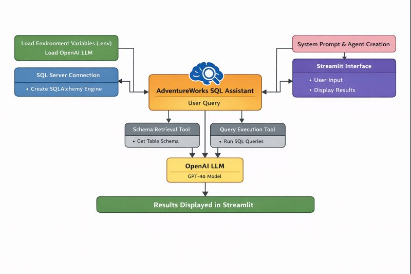
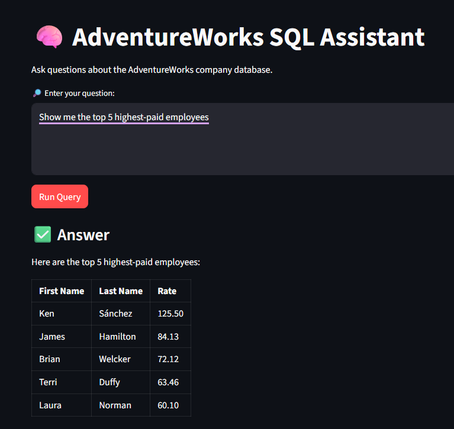

# 🤖 SQL Server Agentic AI

> An intelligent agentic system that autonomously interacts with SQL Server databases using natural language, powered by OpenAI and Langchain.

[](https://www.python.org/downloads/)
[](https://www.langchain.com/)
[](https://www.anthropic.com/)
[](LICENSE)

## 📋 Overview

This project demonstrates an advanced **agentic AI architecture** that enables natural language database interactions. Built with Langchain and Claude AI, the system autonomously generates SQL queries, executes them against SQL Server databases, and provides intelligent responses to complex data questions.

### Key Highlights

- **🎯 Autonomous Decision-Making**: Agent intelligently decides when to query the database vs. provide direct answers
- **🔄 Self-Correcting**: Automatically handles errors and refines queries for accurate results
- **💬 Natural Language Interface**: Ask questions in plain English, get precise data insights
- **🏗️ Production-Ready Architecture**: Built with Langchain for robust, stateful workflow management
- **🔐 Secure**: Implements text() function from SQLAlchemy to protect againt SQL Injection or Accidental Data Corruption from LLM

## 🏗️ Architecture



## 🛠️ Technical Stack

| Technology | Purpose |
|------------|---------|
| **Python** | Core programming language |
| **LangChain/Langchain** | Agent orchestration and workflow management |
| **OpenAI** | Natural language understanding and SQL generation |
| **pyodbc** | SQL Server database connectivity |
| **dotenv** | Environment configuration management |

## ✨ Features

### Core Capabilities
- **Natural Language to SQL**: Translates complex questions into optimized SQL queries
- **Schema-Aware**: Understands database structure for accurate query generation
- **Multi-Turn Conversations**: Maintains context across multiple questions
- **Error Recovery**: Automatically debugs and fixes SQL errors
- **Result Synthesis**: Converts raw data into meaningful insights

## 🎯 Key Skills Demonstrated

- **AI/ML Engineering**: Implementing production-grade agentic AI systems
- **LangChain/Langchain**: Building stateful, multi-step AI workflows
- **Database Engineering**: SQL Server integration and query optimization
- **Python Development**: Clean, maintainable code with best practices
- **System Design**: Architecting autonomous, error-resilient systems
- **API Integration**: Working with modern LLM APIs 
  
## 🚀 Getting Started

### Prerequisites

```bash
# System Requirements
- Python 3.8 or higher
- SQL Server (local or remote instance)
- ODBC Driver for SQL Server
```

### Installation

1. **Clone the repository**
   ```bash
   git clone https://github.com/Vniranjanr/AI-Projects.git
   cd AI-Projects/SQLServer_AgenticAI
   ```

2. **Install dependencies**
   ```bash
   pip install -r requirements.txt
   ```

3. **Configure environment variables**
   ```bash
   # Create .env file
   OPENAI_API_KEY=your_openai_api_key_here
   ```

4. **Update database configuration**
   
   Edit the connection string in the code to point to your SQL Server instance.

### Quick Start

```python
# Run the agent
stremlit run main.py

# Example queries:
# "How many employees are in the Sales department?"
# "What's the average salary by department?"
# "Show me the top 5 highest-paid employees"
```
## 📝 Example Interaction


## 📊 Use Cases

This agentic system excels at:

- **Business Intelligence**: "What were our top-selling products last quarter?"
- **Data Analysis**: "Compare revenue trends across regions"
- **Reporting**: "Generate a summary of customer demographics"
- **Data Exploration**: "What tables contain customer information?"
- **Troubleshooting**: "Find all orders with missing shipment dates"

## 👨‍💻 Author

**Niranjan**

- GitHub: [@Vniranjanr](https://github.com/Vniranjanr)
- LinkedIn: www.linkedin.com/in/vniranjanr

